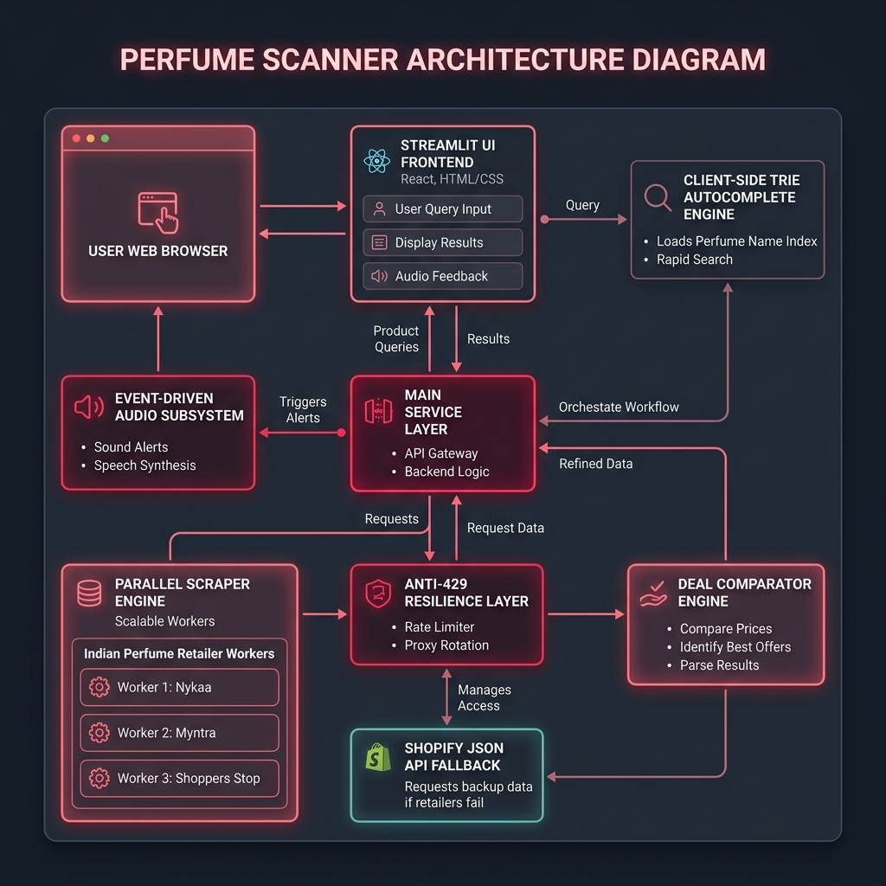
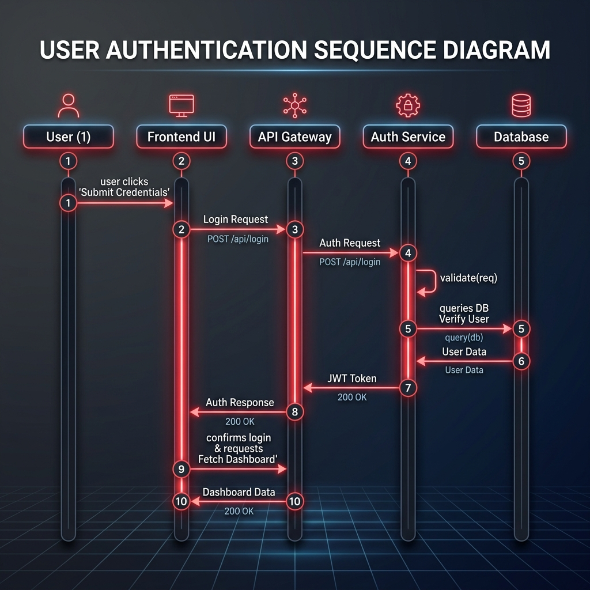

# 🏛️ Perfume Scanner - System Architecture & Engineering Documentation

Welcome to the architectural documentation for **Perfume Scanner**, a real-time fragrance deal comparison engine and price scanner tailored for the Indian specialty perfume market.

---

## 📐 System Architecture Diagram

---

## 🔄 End-to-End Data Flow Sequence

### ⏱️ Data Execution Steps

| Step | Component | Action & Purpose |
| :--- | :--- | :--- |
| **1. Page Load** | `search_widget.py` | Injects Fuse.js client widget & indexes static catalog (`perfume_catalog.py`) with Trie engine. |
| **2. Live Querying** | `autocomplete.py` | Performs $O(K)$ prefix lookups & RapidFuzz similarity matching for instant typo-tolerant suggestions. |
| **3. Form Submit** | `app.py` | Form submit triggers spray audio effect ($t = 0\text{ms}$) and displays spray-mist scanning animation. |
| **4. Parallel Scraping** | `scraper.py` | Launches `ThreadPoolExecutor` fetching live HTML from 11+ Indian retailers concurrently. |
| **5. Anti-429 Fallback** | `scraper.py` | If HTML request encounters HTTP 429 / bot block, automatically queries Shopify edge JSON API (`/search/suggest.json`). |
| **6. Title Cleaning** | `clean_product_title` | Strips stuttered vendor prefixes (e.g. `AFNANAfnan 9pm` ➡️ `Afnan 9pm Eau De Parfum`). |
| **7. Price Comparison** | `comparator.py` | Cleans INR prices, filters decants/samples/vials, sorts prices ascending, and tags `🥇 CHEAPEST DEAL`. |
| **8. Deals Grid** | `app.py` | Renders responsive deal cards with live prices, retailer logos, and direct store checkout links. |
| **9. Audio Feedback** | `app.py` | On zero matches, `` triggers DOM rewind (`currentTime = 0`) to play `faaah.mp3` on every failed search. |

---

## 🧩 Component Architecture Breakdown

### 1. Frontend & Presentation Layer (`src/perfume_scanner/app.py`)
- **Framework**: Streamlit Python framework with embedded custom HTML5/CSS3 glassmorphism styling.
- **Design System**: Crimson/Rose accent color palette, dark mode glassmorphism cards, micro-animations (`spray-box`, mist particles).
- **Search Form**: Containerized form with real-time text input and submit handling.
- **Caching**: Uses `@st.cache_data(ttl=300)` for fast in-memory query retrieval.

### 2. Autocomplete Subsystem (`src/perfume_scanner/autocomplete.py` & `search_widget.py`)
- **Trie Indexing**: Custom `Trie` data structure for prefix lookups over static catalog (`data/perfume_catalog.py`).
- **Fuzzy Search**: `rapidfuzz` string similarity algorithm for typo tolerance.
- **Fuse.js Client Widget**: Single client-side iframe component (`search_widget.py`) that attaches debounced input listeners to the parent DOM.

### 3. Parallel Scraper Engine (`src/perfume_scanner/scraper.py`)
- **Concurrency**: `concurrent.futures.ThreadPoolExecutor` executing 11+ parallel retailer workers.
- **Primary Scraper**: HTTP GET with `urllib.request` using full Chrome 121 browser headers (`Sec-Ch-Ua`, `Sec-Fetch-*`).
- **Anti-429 Resilience Fallback**: Automatic failover to Shopify's edge JSON API (`/search/suggest.json?q=...&resources[type]=product`) when HTML scraping encounters `HTTP 429`.
- **Title Deduplication (`clean_product_title`)**: Regex-based normalization removing stuttered vendor prefixes (e.g. `AFNANAfnan 9pm` ➡️ `Afnan 9pm`).

### 4. Deal Comparison Engine (`src/perfume_scanner/comparator.py`)
- **Price Normalization**: Parses INR currency strings (`₹`, `Rs.`), cleans thousand separators, and converts prices to numeric floats.
- **Decant & Clone Filtering**: Filters out sample vials, 2ml/5ml/10ml decants, and impression clones unless explicitly searched.
- **Best Deal Tagging**: Identifies and badges the cheapest available deal (`🥇 CHEAPEST DEAL`).

### 5. Event-Driven Audio Subsystem
- **Spray Sound**: Base64 WAV spray sound triggered instantly at form submission start ($t = 0\text{ms}$).
- **No-Match Audio (`faaah.mp3`)**: Triggered when zero deals match the query.
- **DOM Rewind Mechanism**: Employs a timestamped `` event handler that forces React Virtual DOM re-mounting and rewinds `currentTime = 0` for 100% reliable repeat audio execution across consecutive failed searches.

---

## 🔒 CI/CD & Repository Management

- **GitHub Actions (`.github/workflows/ci.yml`)**:
  - `validate-pr-title`: Enforces Conventional Commit standards on PR titles using `amannn/action-semantic-pull-request@v5`.
  - `validate-commits`: Validates commit history using `@commitlint/config-conventional`.
- **Repository Governance (`.github/CODEOWNERS`)**: Automatically assigns `@bipinkapri-git` as required code owner reviewer on all pull requests.
